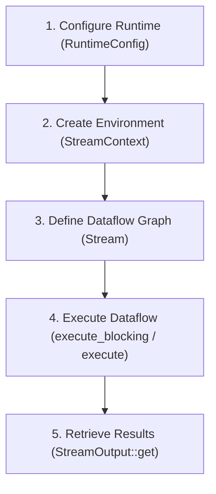

# Code Examples

This section contains a collection of code examples that demonstrate how to build streaming and batch processing dataflows with **Renoir**.

---

## Anatomy of a Renoir Application

Every Renoir application follows a standard step-by-step structure:

<div style="display: flex; flex-wrap: wrap; gap: 24px; align-items: center;" markdown="1">

<div style="flex: 1; min-width: 300px;" markdown="1">

</div>

<div style="flex: 1; min-width: 300px;" markdown="1">
1. **Configure the Runtime**: Define worker topologies using `RuntimeConfig::local()` or `RuntimeConfig::remote()`, or parse them from CLI arguments with `RuntimeConfig::from_args()`.
2. **Initialize the Context**: Create a `StreamContext` using the config. The context manages the lifecycle and execution of all streams.
3. **Build the Operator Graph**: Create initial `Stream`s using sources (e.g., `stream_file`, `stream_iter`) and chain operators (like `map`, `filter`, `group_by`, and `fold`) to define the computation logic.
4. **Run the Dataflow**: Call `execute_blocking()` (synchronous) or `execute().await` (asynchronous) on the context to spawn workers and start processing.
5. **Get output**: Retrieve data from `StreamOutput` handles (returned by sink operators like `collect_vec`) using `.get()`.
</div>

</div>

---

## 1. Wordcount (Basic)

The classic "hello world" of data processing. This application reads a text file line-by-line, splits lines into words, partitions words across worker threads, and counts occurrences.

```rust
use renoir::prelude::*;

fn main() {
    // 1. Parse configuration from CLI arguments
    let (config, args) = RuntimeConfig::from_args();
    config.spawn_remote_workers();
    
    // 2. Initialize the execution environment
    let env = StreamContext::new(config);

    // 3. Define the operator graph
    let result = env
        // Read the file specified in the command line argument line-by-line
        .stream_file(&args[1])
        // Split each line into individual lowercase words
        .flat_map(|line| tokenize(&line))
        // Repartition elements: words with the same value end up on the same worker node
        .group_by(|word| word.clone())
        // Fold (aggregate) occurrences locally and globally per word
        .fold(0, |count, _word| *count += 1)
        // Collect final key-value pairs into a vector on the main host
        .collect_vec();
        
    // 4. Trigger synchronous execution across all cluster nodes
    env.execute_blocking();
    
    // 5. Retrieve and print results
    if let Some(output) = result.get() {
        output.into_iter().for_each(|(word, count)| {
            println!("{word}: {count}");
        });
    }
}

fn tokenize(s: &str) -> Vec<String> {
    s.split_whitespace().map(str::to_lowercase).collect()
}
```

### Step-by-Step Walkthrough

- **`stream_file`**: Reads chunks of the file in parallel if multiple workers are available. Each line is emitted as a `String`.
- **`flat_map`**: Evaluates the `tokenize` closure for each line and flattens the resulting `Vec<String>` into individual stream items.
- **`group_by`**: A partition operator that hashes each word and distributes them. It splits the current operator block, forcing a network shuffle.
- **`fold`**: Aggregates the count. Since it is called after `group_by`, it accumulates values sequentially on the destination replicas.
- **`collect_vec`**: Gathers all `(String, usize)` pairs from the cluster back to the coordinator machine.

**To run locally with 4 threads:**
```bash
cargo run --release -- --local 4 path/to/input.txt
```

---

## 2. Wordcount (Optimized & Associative)

For high-throughput pipelines, the basic Wordcount has a bottle-neck: every single word must be shuffled over the network. We can optimize this by performing **local pre-aggregation** before shuffling, and tuning the **batching strategy**.

```rust
use renoir::prelude::*;

fn main() {
    let (config, args) = RuntimeConfig::from_args();
    let env = StreamContext::new(config);

    let result = env
        .stream_file(&args[1])
        // Optimization 1: Use fixed batch size for high-throughput batch datasets
        .batch_mode(BatchMode::fixed(1024))
        .flat_map(|line| tokenize(&line))
        .map(|word| (word, 1usize))
        // Optimization 2: Pre-aggregate counts locally on each replica before shuffling
        .group_by_reduce(|w| w.clone(), |(_w1, c1), (_w2, c2)| *c1 += c2)
        .unkey()
        .collect_vec();

    env.execute_blocking();
    
    if let Some(output) = result.get() {
        output.into_iter().for_each(|(word, count)| {
            println!("{word}: {count}");
        });
    }
}

fn tokenize(s: &str) -> Vec<String> {
    s.split_whitespace().map(str::to_lowercase).collect()
}
```

### Optimizations Explained

1. **`batch_mode(BatchMode::fixed(1024))`**: By default, Renoir uses adaptive batching to balance latency and throughput. If processing a static file (where latency is not critical), forcing fixed-size batches reduces batching overhead and improves performance.
2. **`group_by_reduce`**: Unlike `group_by` followed by `fold`, this associative operator aggregates counts *locally* on each replica first. Only the unique words and their partial sums are sent over the network, dramatically reducing network traffic.

---

## 3. Async Wordcount (Tokio Integration)

If your pipeline integrates with asynchronous systems (like databases, async file systems, or custom web clients), you can enable the `tokio` feature flag and run the dataflow inside an async main thread.

```rust
use renoir::prelude::*;

#[tokio::main]
async fn main() {
    let (config, args) = RuntimeConfig::from_args();
    config.spawn_remote_workers();
    let env = StreamContext::new(config);

    let result = env
        .stream_file(&args[1])
        .flat_map(|line| tokenize(&line))
        .group_by(|word| word.clone())
        .fold(0, |count, _word| *count += 1)
        .collect_vec();

    // Trigger execution asynchronously using .execute().await
    env.execute().await;

    if let Some(output) = result.get() {
        output.into_iter().for_each(|(word, count)| {
            println!("{word}: {count}");
        });
    }
}

fn tokenize(s: &str) -> Vec<String> {
    s.split_whitespace().map(str::to_lowercase).collect()
}
```

> [!TIP]
> Ensure the `tokio` feature is enabled in your `Cargo.toml`:
> `renoir = { version = "0.6.0", features = ["tokio"] }`

---

## 4. Enriching Events (Stream Join)

In real-world streaming pipelines, you often need to correlate two independent streams. This example joins a high-volume clickstream with a stream of user profile metadata to calculate page views grouped by user country.

```rust
use renoir::prelude::*;

#[derive(Clone, Debug)]
struct ClickEvent {
    user_id: u64,
    page: String,
}

#[derive(Clone, Debug)]
struct UserProfile {
    user_id: u64,
    country: String,
}

fn main() {
    let ctx = StreamContext::new_local();

    // Clickstream source
    let clicks = ctx.stream_iter(vec![
        ClickEvent { user_id: 1, page: "home".into() },
        ClickEvent { user_id: 2, page: "about".into() },
        ClickEvent { user_id: 1, page: "docs".into() },
        ClickEvent { user_id: 3, page: "home".into() },
    ]);

    // Reference dataset source (User profiles)
    let profiles = ctx.stream_iter(vec![
        UserProfile { user_id: 1, country: "Italy".into() },
        UserProfile { user_id: 2, country: "Germany".into() },
        UserProfile { user_id: 3, country: "Italy".into() },
    ]);

    // Join clicks and profiles based on user_id
    let result = clicks
        .join(profiles, |c| c.user_id, |p| p.user_id)
        .drop_key() // Discard user_id used for joining; outputs ((ClickEvent, UserProfile))
        .map(|(click, profile)| (profile.country, click.page))
        .group_by(|(country, _page)| country.clone())
        .fold(0usize, |count, _| *count += 1)
        .collect_vec();

    ctx.execute_blocking();

    if let Some(res) = result.get() {
        for (country, count) in res {
            println!("{country}: {count} views");
        }
        // Output:
        // Italy: 3 views
        // Germany: 1 views
    }
}
```

---

## 5. Sliding Top-K (Windowing & Event Time)

This advanced example demonstrates event-time windows and watermarks. It processes a stream of messages (e.g. hashtags), assigns event timestamps, constructs a sliding window, and finds the top-K most frequent hashtags in each window.

```rust
use renoir::prelude::*;

fn main() {
    let win_size_millis = 1000;
    let win_step_millis = 500;
    let k = 3;

    let ctx = StreamContext::new_local();

    // Source emits tuples of (timestamp_millis, hashtag)
    let raw_events = vec![
        (100, "#rust".to_string()),
        (200, "#programming".to_string()),
        (300, "#rust".to_string()),
        (600, "#programming".to_string()),
        (800, "#rust".to_string()),
        (1200, "#dataflow".to_string()),
    ];

    let result = ctx.stream_iter(raw_events)
        // 1. Assign event-time timestamps and generate watermarks
        .add_timestamps(
            |(ts, _)| *ts, 
            {
                let mut count = 0;
                move |_, &ts| {
                    count += 1;
                    // Emit a watermark every 3 elements
                    if count % 3 == 0 { Some(ts) } else { None }
                }
            }
        )
        // 2. Discard original tuple timestamps (they are now internal event-time)
        .map(|(_ts, hashtag)| hashtag)
        // 3. Partition by hashtag
        .group_by(|h| h.clone())
        // 4. Group hashtags into sliding event-time windows
        .window(EventTimeWindow::sliding(win_size_millis, win_step_millis))
        // 5. Count occurrences of each hashtag in each window
        .map(|w| w.len())
        .unkey()
        // 6. Gather all counts for the same window boundaries
        .window_all(EventTimeWindow::tumbling(win_step_millis))
        // 7. Find top-K frequent hashtags inside each window
        .map(move |mut words| {
            words.sort_by_key(|(_h, count)| -(*count as i64));
            words.truncate(k);
            words
        })
        .collect_vec();

    ctx.execute_blocking();

    if let Some(windows) = result.get() {
        for (idx, top_k) in windows.into_iter().enumerate() {
            println!("Window {idx}: {top_k:?}");
        }
    }
}
```

---

## 6. Transitive Closure (Iterative Loop)

Renoir natively supports iterative computations (feedback loops in the operator graph) using the `.iterate(...)` operator. This example calculates the transitive closure of a directed graph: if paths `z -> x` and `x -> y` exist, it generates the path `z -> y`, iterating until no new paths are discovered.

```rust
use renoir::prelude::*;

fn main() {
    let num_iterations = 100;
    let ctx = StreamContext::new_local();

    // Initial edges of the graph (directed)
    let initial_edges = vec![
        (1u64, 2u64),
        (2, 3),
        (3, 4),
    ];

    // Split the edge stream: one for iteration feed, one for joining inside the loop
    let mut edges = ctx.stream_iter(initial_edges).split(2);
    let edges_join = edges.pop().unwrap();
    let initial_paths = edges.pop().unwrap();

    // Run the feedback loop
    let (iteration_state, closure_result) = initial_paths.iterate(
        num_iterations,
        // State maintains: (old_path_count, new_path_count, current_iteration)
        (0, 0, 0),
        // Loop body: takes the current path stream (s) and dynamic state
        move |s, _state| {
            let mut paths = s.split(2);
            paths
                .pop()
                .unwrap()
                // Join current paths with initial edges: (z -> x) JOIN (x -> y)
                .join(edges_join.clone(), |(_z, x)| *x, |(x, _y)| *x)
                // Generate transitively closed path: z -> y
                .map(|(_, ((z, _), (_, y)))| (z, y))
                .drop_key()
                // Merge back previously discovered paths
                .merge(paths.pop().unwrap())
                // Deduplicate paths
                .group_by_reduce(|(x, y)| (*x, *y), |_, _| {})
                .drop_key()
                // Filter out self-loops (z -> z)
                .filter(|(x, y)| x != y)
        },
        // Step 1: Accumulate feedback counts on each worker node
        |count: &mut u64, _| *count += 1,
        // Step 2: Global reducer to update the path count state
        |(_old, new, _iter), count| *new += count,
        // Step 3: Loop termination condition (returns true to continue, false to break)
        |(old, new, iter)| {
            *iter += 1;
            let has_changed = old != new;
            *old = *new;
            *new = 0; // Reset for next iteration
            has_changed
        },
    );

    let result = closure_result.collect_vec();
    iteration_state.for_each(|(_, _, iter)| {
        println!("Graph processing converged after {iter} iterations.");
    });

    ctx.execute_blocking();

    if let Some(mut paths) = result.get() {
        paths.sort_unstable();
        println!("Transitive closure paths: {paths:?}");
        // Output:
        // Transitive closure paths: [(1, 2), (1, 3), (1, 4), (2, 3), (2, 4), (3, 4)]
    }
}
```
